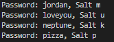

Writeup 9 - Crypto I
=====

Name: Justin Van Dort  
Section: 0102

I pledge on my honor that I have not given or received anyunauthorized assistance on this assignment or examination.

Digital acknowledgement of honor pledge: Justin Van Dort

## Assignment 9 Writeup

### Part 1 (60 Pts)

My solution is relatively simple in that it's just two loops, where on each iteration, the hash of the concatenation of the salt and password is compared to each of provided hashes. If there is a match, the password and salt combination is printed. 

More specifically, the program first loads the `hashes` file into memory, and then iterates through each line of the password file without loading the entire file into memory. On each iteration of the password file, the salt is prepended to the password, and hashed with SHA-512. The output of the hash function is then compared to each of stored hashes. Using hashlab was simple, and only required a single line of code to calculate the hash of the salt and password. The computation was also very fast, since the password list was very short. 

Program output:

/week/9/writeup$ ./part1.py

Password: jordan, Salt m  
Password: loveyou, Salt u  
Password: neptune, Salt k  
Password: pizza, Salt p  

The screenshot, as requested.  



### Part 2 (40 Pts)

Part 2 was more difficult for me than part 1, even though it is worth less points. My first step was running `nc 142.93.117.193 7331` to see what type of response the server is sending on initial connection. I was prompted with a request asking for the `sha389` hash of a randomized string. So, I went to Google to find an online hash calculator, and found the sha389 hash of the provided string. Then, the server responded with another question. It was in the same format of the first question, but had a different hash function and input string. 

I began writing the python script, and used `socket.makefile()` to easilly read lines from the socket. Then, I removed the header lines and used `string.split` to get the hash function and input string. I passed the hash function string directly into the constructor for hashlib, and sent the resulting string to the server. After getting that working, I put the code I just wrote in a loop which terminated when the server closed the connection. 

With some quick tweaks, I got the loop to a point where it would solve each question from the server. The final response from the server was:

```
1541716461

1541716461

You win! CMSC389R-{H4sh-5l!ngInG-h@sH3r}
```
I'm not sure what the numbers mean, but I did find the flag. 

In all, the script simply loops through each line recieved from the server until it finds one which contains 'Find me'. Then, it parses that line, calculates the answer, and sends it back to the server. 